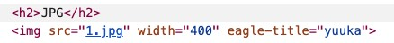
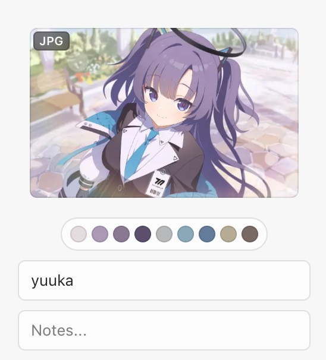

# Eagle Custom Collection Attributes (Eagle Attributes)
Language: [English](README.md) / [Traditional Chinese](README_zh-tw.md) / [Simplified Chinese](README_zh-cn.md)

Eagle is a powerful asset management tool that simplifies the process of collecting, managing, and searching for your digital resources.

For those with programming skills, the functionality of your Eagle collection can be extended by writing custom scripts, such as userscripts. Customize your collection by defining titles, links, image resolutions, and adding annotations and tags to cater to your specific needs.

## Available Attributes
These are the attributes you can utilize within your scripts:
| Attribute | Description |
| --------- | ----------- |
| eagle-title | Overrides the title of the collected asset |
| eagle-src | Overrides the URL of the collected asset |
| eagle-annotation | Adds annotation to the collected asset |
| eagle-tags | Adds tags to the collected asset |
| eagle-link | Overrides the source URL of the collected asset |

## How to Use

Here's a step-by-step guide on implementing these attributes on your website:

1. Select the element you wish to modify.
2. Add the desired attribute to the element's tag. For instance, to modify the title, add the `eagle-title` attribute.
3. Input the desired content as the value of the attribute. For example, `eagle-title="My Custom Title"` sets the title as "My Custom Title".

```javascript
// Select all img tags on the page
var images = document.getElementsByTagName('img');

// Iterate through each img tag
for (var i = 0; i < images.length; i++) {
    // Add the eagle-src attribute to each img tag with custom title
    images[i].setAttribute('eagle-title', 'my custom title');
}
```

## Demonstration Cases

### Customizing Collection Titles

To customize the collection title of an image on a webpage, add the `eagle-title` attribute to the image element with your desired title. When you collect the image using the Eagle browser extension, your set title will be preserved.

```html

```



### Customizing Collection Image URLs

Sometimes a website may display a thumbnail instead of the full-sized image. If you know the URL of the original image, you can use the `eagle-src` attribute to set the element's full-sized image URL. When you collect it, you'll obtain the URL of the original image.

```html

```

### Defining Custom Image Links and Adding Annotations

To set a custom link for an image and add annotations, use the `eagle-link` and `eagle-annotation` attributes together. Here's an example:

```html

```

In this example, when you collect the image using the Eagle browser extension, you'll receive the custom link, and the annotation will be "My Custom Annotation".

## Frequently Asked Questions (FAQ)

Q: Where can I find more information about Eagle? \
A: More information about Eagle can be found on our [official website](https://eagle.cool/).

Q: Where can I find more information on writing scripts? \
A: Refer to websites like [Greasy Fork](https://greasyfork.org/en) and [Tampermonkey](https://www.tampermonkey.net/) for information on scripting.