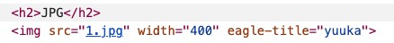
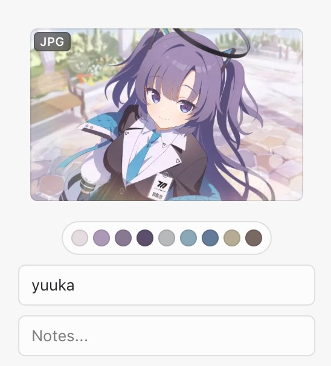

# Eagle 自定义收藏属性 (Eagle Attributes)
语言：[English](README.md) / [繁體中文](README_zh-tw.md) / [简体中文](README_zh-cn.md)

Eagle 是一款功能强大的素材管理工具，它能帮助您便捷地收藏、管理和搜索数字素材。

如果您具备一定的编程基础，可以通过编写自定义脚本（例如用户脚本），来扩展 Eagle 收藏的功能。您可以自定义收藏项目的标题、链接、图片分辨率，并添加注释和标签，满足您的特定需求。

## 可用属性
以下是您在脚本中可以使用的属性列表：
| 属性名称 | 描述 |
| --------- | ----------- |
| eagle-title | 覆盖收藏素材的标题 |
| eagle-src | 覆盖收藏素材的网址 |
| eagle-annotation | 为收藏素材添加注释 |
| eagle-tags | 为收藏素材添加标签 |
| eagle-link | 覆盖收藏素材的来源网址 |

## 使用方法

以下是在您的网站上实施这些属性的步骤：

1. 选择您希望修改的元素。
2. 在该元素的标签中，添加您想要使用的属性。例如，要修改标题，添加 `eagle-title` 属性。
3. 在属性的值中，输入您想要的内容。例如，`eagle-title="我的自定义标题"` 会设置标题为 "我的自定义标题"。

```javascript
// 选择页面上的所有 img 标签
var images = document.getElementsByTagName('img');

// 遍历每个 img 标签
for (var i = 0; i < images.length; i++) {
    // 为每个 img 标签添加 eagle-title 属性，并将其值设置为 "my custom title"
    images[i].setAttribute('eagle-title', "my custom title");
}
```

## 演示案例

### 自定义收藏标题

要自定义网页上图片的收藏标题，请为图片元素添加 `eagle-title` 属性，并设定您希望的标题。当您使用 Eagle 浏览器扩展功能收藏图片时，您设定的标题将被保留。

```html

```



### 自定义收藏图片网址

有时，网站可能只显示图片的缩略图而非完整尺寸。如果您知道原始完整图片的网址，您可以使用 `eagle-src` 属性直接设置元素的完整图片网址。当您收藏该图片时，您将获得原始完整图片的网址。

```html

```

### 定义自定义图片链接并添加注释

若要为图片设置自定义链接并添加注释，可同时使用 `eagle-link` 和 `eagle-annotation` 属性。以下是一个示例：

```html

```

在此示例中，当您使用 Eagle 浏览器扩展功能收藏这张图片时，将直接获得自定义链接地址，并且图片的注释将会是 "我的自定义注释"。

## 常见问题解答

Q：我在哪里可以找到更多关于 Eagle 的信息？ \
A：您可以在我们的 [官方网站](https://eagle.cool/) 上找到更多关于 Eagle 的信息。

Q：我在哪里可以找到更多关于编写脚本的信息？ \
A：您可以参考像是 [Greasy Fork](https://greasyfork.org/zh-CN) 和 [Tampermonkey](https://www.tampermonkey.net/) 的网站获取编写脚本的信息。